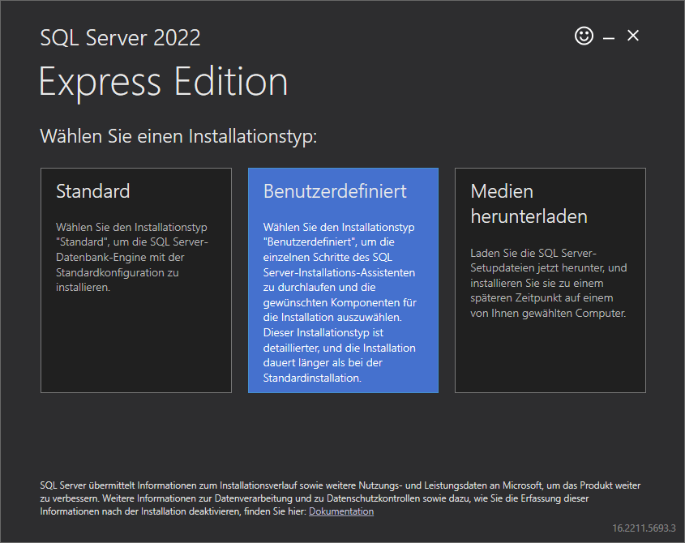
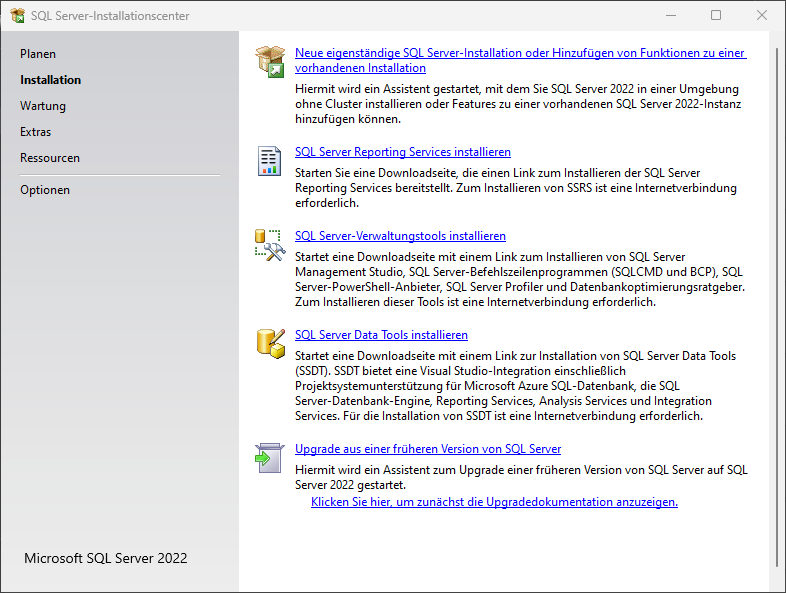
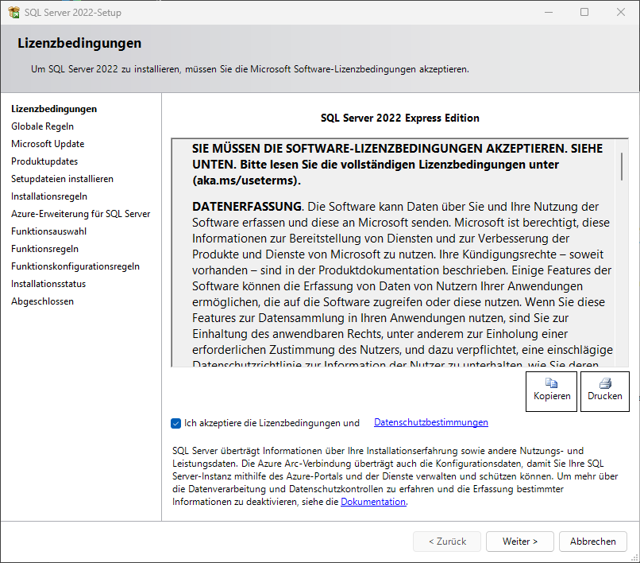
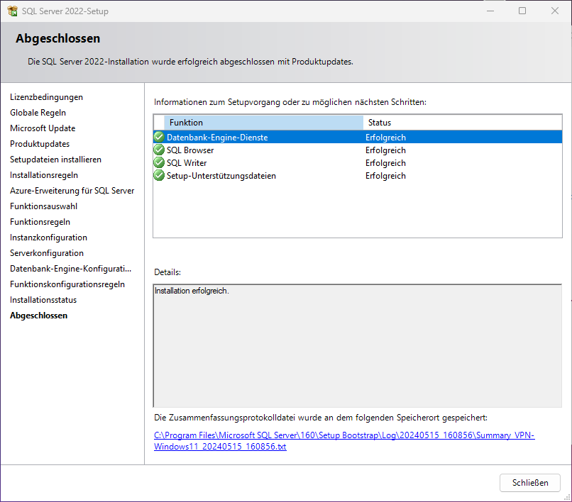
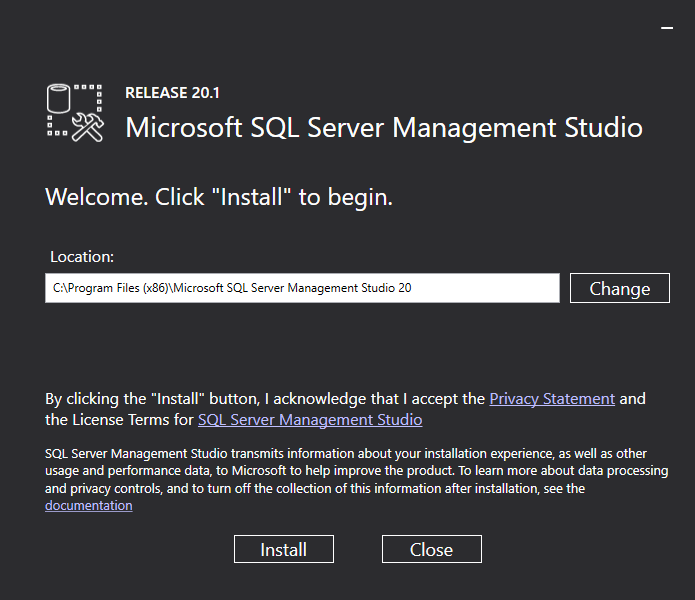
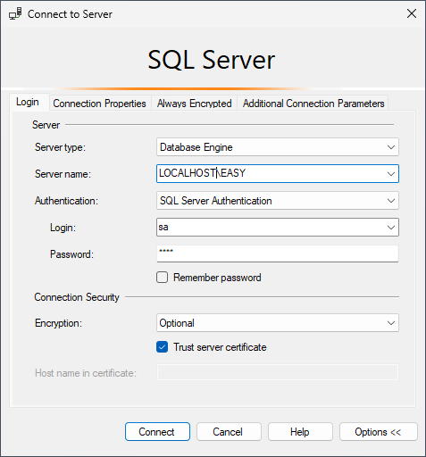
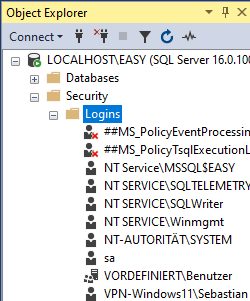
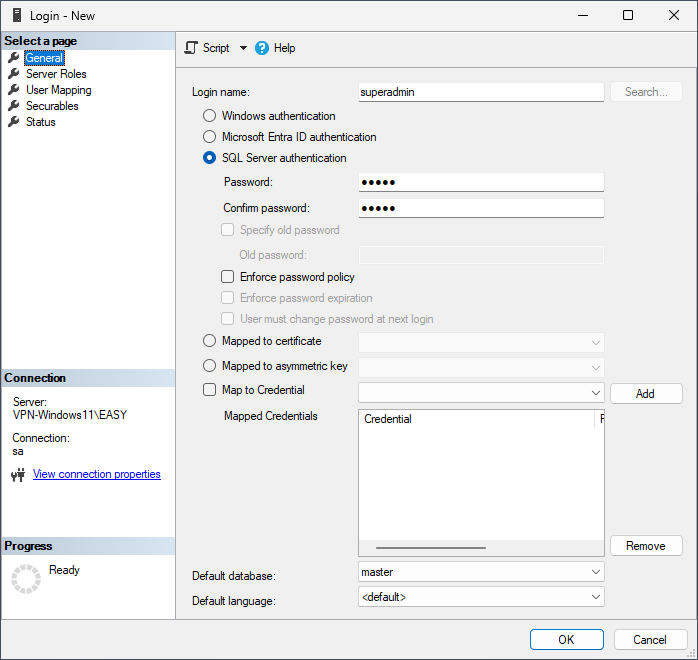
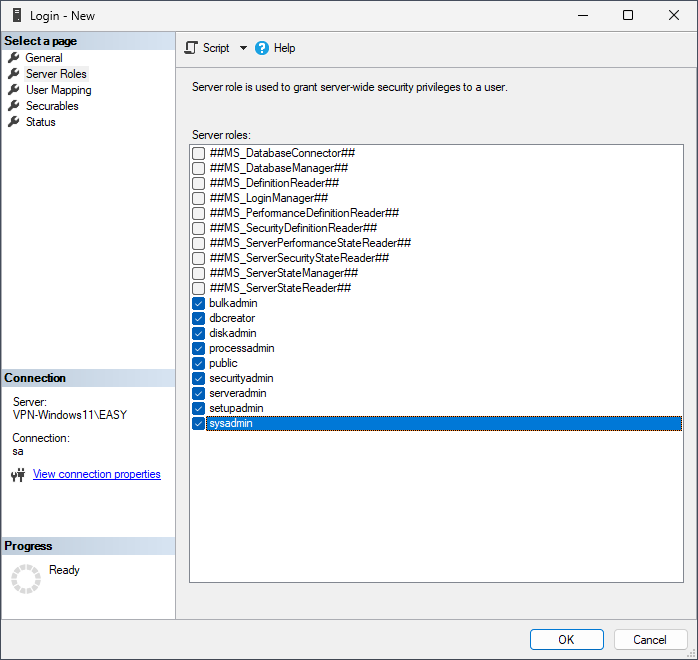

[Zurück](../README.md)
# Installation

- [1. Vorbereitung](#1-vorbereitung)
  - [Dateisystem](#dateisystem)
  - [Zusätzliche Software](#zusätzliche-software)
- [2. JAVA SDK \& JAVA RE](#2-java-sdk--java-re)
- [3. MS SQL](#3-ms-sql)
- [4. SQL Server Management Studio (SSMS)](#4-sql-server-management-studio-ssms)

## 1. Vorbereitung
### Dateisystem
Zusätzlich zur Systempartition sind zwei weitere Partitionen **D** und **E** notwendig. Beide sollten über ausreichend Speicherplatz verfügen.

Sind die beiden Partitionen eingerichtet, werden als nächstes die Verzeichnisse `D:\Easy\`, `D:\Install` und `E:\Datenbanken` angelegt.

### Zusätzliche Software
Damit die Aufgaben leicht und schnell erledigt werden können, empfiehlt es sich einige Zusatzprogramme zu installieren, sofern diese noch nicht vorhanden sind.
* Adobe Acrobat Reader (<https://get.adobe.com/de/reader/>)
* Keystore Explorer (<https://keystore-explorer.org/downloads.html>)
* NetTools (<https://nettools.net/download/>)
* Notepad++ (<https://notepad-plus-plus.org/downloads/>)
* PDF24 (<https://tools.pdf24.org/de/creator>)
* Rapid Environment Editor (<https://www.rapidee.com/en/download>)
* SnakeTail (<https://snakenest.com/snaketail/>)

## 2. JAVA SDK & JAVA RE
Die aktuelle Java Runtime Environment kann unter <https://www.java.com/de/download/manual.jsp> heruntergeladen werden und wird unter `D:\Easy\JRE-<NR>` installiert. Mit Hilfe des Rapid Environment Editor wird eine Benutzervariable `JAVA_HOME` hinzugefügt, in der der Pfad der eben installierten JRE gespeichert wird.

Anschließend empfiehlt es sich das Verzeichnis `D:\Easy\JRE-<NR>\bin` ind die Path-Variable aufzunehmen. Apps in diesem Verzeichnis wie `keytool.exe` müssen dann nicht mehr mit dem vollständigen Pfad aufgerufen werden.

## 3. MS SQL
Unter <https://www.microsoft.com/de-de/sql-server/sql-server-downloads> kann die aktuelle kostenlose SQL Server Express Version heruntergeladen werden. Anschließend wird eine benutzerdefinierte Installation gestartet; das Verzeichnis, in das die Installationsdateien heruntergeladen werden sollen kann auf dem Standardwert belassen werden.

Nachdem die Setupdateien abgerufen sind, wird im SQL Server-Installationscenter eine *Neue eigenständige SQL Server-Installation* gestartet.

Anschließend öffnet sich ein Setup-Dialogfenster.

***Lizenbedingungen:*** 
* Akzeptieren
  
***Microsoft Update:*** 
* *Mit Microsoft Updates suchen* auswählen 
 
***Azure-Erweiterung für SQL-Server:*** 
* *Azure-Erweiterung für SQL Server* abwählen  

***Funktionsauswahl:*** 
* *Datenbank-Engine-Dienste* ohne weitere Unterfunktionen auswählen  
* *Instanzstammverzeichnis* `D:\MSSQL`

***Instanzkonfiguration:***
* *Benannte Instanz* mit Namen `EASY`

***Serverkonfiguration:***
* Im Reiter *Sortierung* die Datenbank-Engine auf `Latin1_General_CI_AS` einstellen.

***Datenbank-Engine-Konfiguration***
* Im Reiter *Serverkonfiguration* den Punkt *Gemischter Modus* auswählen und als Passwort für den Benutzer *sa* `easy` wählen und - sofern noch nicht vorhanden - über *Aktuellen Benutzer hinzufügen* den aktuellen Benutzer zur Liste hinzufügen.
* Im Reiter Datenverzeichnisse das das *Datenstammverzeichnis* auf `E:\Datenbanken` setzen. Die restlichen Verzeichnisse aktualisieren sich von selbst.

Anschließend startet die Installation.

## 4. SQL Server Management Studio (SSMS)
Mit dem SQL Server Management Studio lässt sich der SQL Server einfach verwalten und kann unter <https://learn.microsoft.com/de-de/sql/ssms/download-sql-server-management-studio-ssms?view=sql-server-ver16#download-ssms> heruntergeladen werden.  
Nach dem Start kann das Installationsverzeichnis auf dem vorgeschlagenen Standard belassen werden, weitere Optionen in der Installation gibt es nicht.

Der Login in den SQL Server unter `LOCALHOST\EASY` kann anschließend entweder mit dem SQL Benutzer *sa* oder der aktuellen Windowsanmeldung erfolgen. Ist kein Zertifikat installiert, schlägt die Verbindung fehl; daher die Auswahl *Encryption* auf *Optional* stellen und *Trust server certificate* auswählen.

Im Object Explorer kann mit einem Rechtsklick auf *Security* ein neuer Login mit der Option *SQL Server authentication*, dem *Login name* `superadmin` und dem Passwort `super` erstellt werden. Die Optionen *Enforce password policy*, *Enforce password expiration* und *User must change password at next login* werden abgewählt.  
Unter *Server Roles* alle Admin Rollen auswählen.

