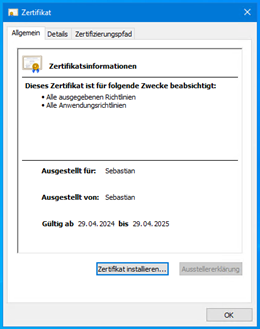

[Zurück](../README.md)
# SSL Verschlüsselung von Documents

- [Zertifikat importieren](#zertifikat-importieren)
	- [Tomcat Connector](#tomcat-connector)
- [Zertifikat selbst erzeugen](#zertifikat-selbst-erzeugen)
	- [Tomcat Connector](#tomcat-connector-1)
	- [Installation des Zertifikats auf den Clients](#installation-des-zertifikats-auf-den-clients)
- [Proxy](#proxy)

Um die Verbindung von Documents und einem Client über einen sicheren und vertrauenswürdigen Kanal hergestellt wird, muss auf dem Documents-Server ein Zertifikat installiert werden. Hierzu kann entweder ein bestehendes Zertifikat, dass durch eine Zertifizierungsstelle unterschrieben wurde oder ein selbst ausgestelltes Zertifikat verwendet werden. Da in den meisten Fällen die Verbindung nur über ein internes Netzwerk aufgebaut wird und keine externe Zertifizierung erfolgen kann, bleibt nur die Verwendung eines selbst ausgestellten Zertifikats.

Für die folgende Anleitung wird davon ausgegangen, dass das bin-Verzeichnis der Java-Version in der PATH-Variable vorhanden ist und bereits eine Documents-Installation ohne SSL-Verschlüsselung vorhanden ist.

Es müssen die notwendigen Parameter wie Name, Ort, Land des Kunden, sowie alle möglichen DNS-Namen und IP-Adresse des Servers bekannt sein.

## Zertifikat importieren

### Tomcat Connector

## Zertifikat selbst erzeugen
Im Tomcat-Verzeichnis der Documents-Installation (bspw D:\\Easy\\Documents5\\tomcat9) einen Ordner „cert“ anlegen und diesen mit einer CMD mit Administratorrechten öffnen. Dort folgenden Befehl anpassen und (in einer Zeile) ausführen

```
keytool
	-genkeypair
	-alias <SERVERNAME>
	-keystore keystore.jks
	-storepass changeit
	-storetype PKCS12
	-keypass changeit
	-keyalg RSA
	-keysize 2048
	-validity 365
	-dname "CN=<SERVERNAME oder DNSNAME>,O=<ORGANISATION>,OU=Documents,L=<ORT>,S=<BUNDESLAND>,C=<LAND>"
	-ext SAN=dns:<DNSNAME1>,dns:<DNSNAME2>,…,ip:<IPADRESSE> 
```

Der Parameter validity bezeichnet die Gültigkeit des Zertifikats in Tagen und kann beliebig gewählt werden. Der Parameter -ext SAN gibt die „Subject Alternative Names“ an. Diese sind notwendig, damit das Zertifikat auf eine Verbindung bezogen sein kann. Ohne diese ist die Verbindung nicht vertrauenswürdig und schlägt je nach Umgebung fehl.

Weitere Informationen zum keytool finden sich bspw hier: <https://gist.github.com/Hakky54/7a2f0fcbcf5fdf4674d48f1a0b31c862>

### Tomcat Connector

Der erzeugte Keystore muss nun im Tomcat eingebunden werden. Hierzu kann in der `{documents-install-dir}\tomcat[8/9]\conf\server.xml` entweder ein bestehender Connector angepasst werden oder ein neuer Connector mit einem neuen Port erzeugt werden.

*Beispiel:*
```XML
<Connector port="8089" protocol="HTTP/1.1"
	connectionTimeout="180000"
	maxParameterCount="1000"
	maxPostSize="8388608"
	maxHttpHeaderSize="32768"
	redirectPort="8443"
/>

<Connector port="8090" protocol="HTTP/1.1"
	connectionTimeout="180000"
	maxParameterCount="1000"
	maxPostSize="8388608"
	maxHttpHeaderSize="32768"
	redirectPort="8443"
	SSLEnabled="true"
	scheme="https"
	keystoreFile="cert/keystore.jks"
	keypass="changeit"
/>
```
Im Beispiel ist ein Keystore `cert/keystore.jks` mit dem Passwort *changeit* erzeugt worden. Die unverschlüsselte Verbindung wird über den Port 8090 aufgebaut, die SSL-verschlüsselte Verbindung läuft über den Port 8091.

### Installation des Zertifikats auf den Clients
Damit die Verbindung vertrauenswürdig ist, muss das Zertifikat auf den Clientrechnern (auch auf dem Server selbst) installiert werden. Hierfür wird zunächst die Zertifikatsdatei benötigt, an die man entweder über den Browser oder über das keytool kommt.
```
keytool
	-exportcert
	-keystore keystore.jks
	-storepass changeit
	-alias <SERVERNAME>
	-file <SERVERNAME>.crt
```

Die Installation des Zertifikats erfolgt bspw über einen Doppelklick und „Zertifikat installieren“



Das Verteilen von Zertifikaten über GPO wird hier beschrieben: <https://learn.microsoft.com/de-de/windows-server/identity/ad-fs/deployment/distribute-certificates-to-client-computers-by-using-group-policy>

## Proxy
Documents kann auch hinter einem Proxy liegen, der die Adressauflösung übernimmt und die Verbindung absichert. Hierfür wird der Connector in der `{documents-install-dir}\tomcat[8/9]\conf\server.xml` wie folgt konfiguriert.

```XML
<Connector port="8090" protocol="HTTP/1.1"
	connectionTimeout="20000"
	redirectPort="8443"
	maxPostSize="8388608"
	maxHttpHeaderSize="32768"
	proxyName="<PROXYNAME>"
	proxyPort="443"
	scheme="https"
/>
```

`<PROXYNAME>` kann eine IP oder ein DNS-Name sein und muss vom Kunden bereitgestellt werden.